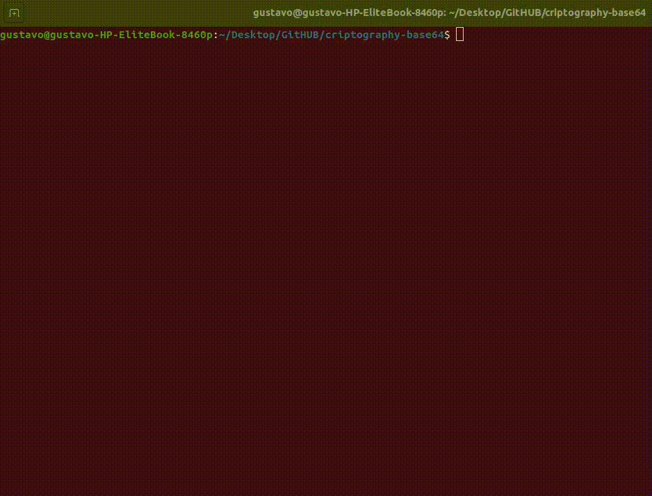

# HISOKA PORT SCANNER

Neste repositório, trago o código fonte de encrypter e decrypter de texto usando base64.
O objetivo deste repositório é ajudar a comunidade a se desenvolver , além de manter afiada minhas habilidades desenvolvendo usando a linguagem Python.

## Versões

**23/09/2020**

- [x] Menu de opção DECODER e ENCODER.
- [x] Função DECODIFICAR.
- [x] Função CODIFICAR.

## Ideias para possiveis atualizacoes 

- [ ] Armazenar os dados de cada encriptação organizadamente dentro da pasta logs, em arquivos de texto.
- [ ] Armazenar os dados de cada encriptação em um banco de dados.

## Como usar

- Após clonar o repositório, use o seguinte comando: $ python3 index.py , e siga as instruções.

## Documentacao e explicacao da versao atual:
[Artigo Linkedin](#)
